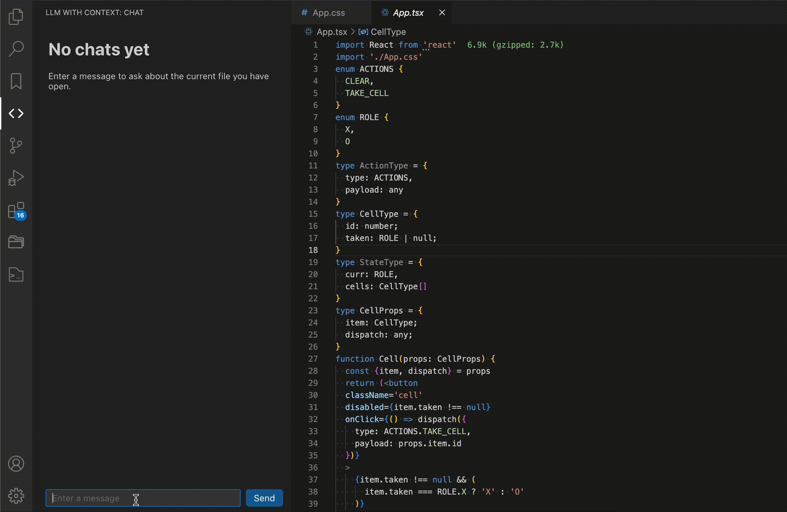
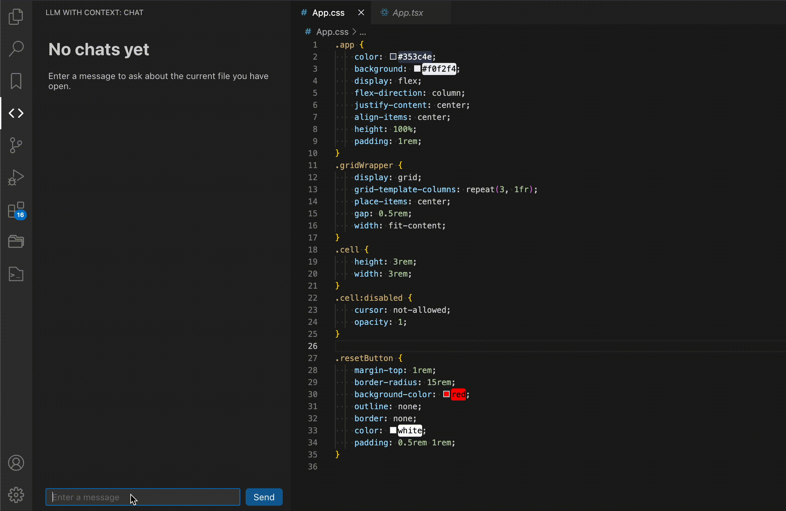
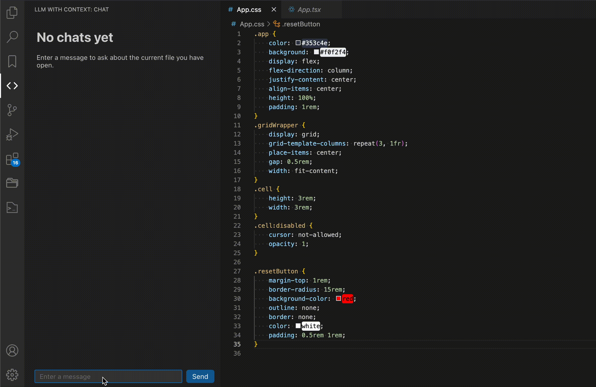

# VS Code Extension - LLM Chat With Context

This is a VS-Code extension that provides a LLM chat interface with editor context.

## Features

### Knowledge of the Current File

### Uses Markdown to Render Complex LLM Responses

### Responds to VSCode Global Theme Changes

### Maintains Context Across Different Languages

## Configuration

### OpenAI API Key

`vscode-chat-with-context.OPENAI_API_KEY`

-   Your OpenAI API Key

### OpenAI Model

`vscode-chat-with-context.OPENAI_MODEL`

-   "A valid OpenAI model tag (defaults to `gpt-3.5-turbo`)

### OpenAI Base URL

`vscode-chat-with-context.OPENAI_BASE_URL`

-   A base url to make requests to. Can be substituted for a local LLM base URL
-   Defaults to `https://api.openai.com/v1/chat/completions`

## Running and Debugging Locally

1. Run `nvm use` or verify you are running **Node 20**
2. Run `npm install` in the root directory
3. Switch to the `/src/client` directory and make sure to be on **Node 20** here as well
4. Run `npm install` in the `/src/client` directory
5. Open in VS Code and in the debug menu, Choose `Build Client`
6. Open in VS Code and in the debug menu, Choose `Run Extension`
7. Specify your OPENAI_API_KEY in the Extension Settings
